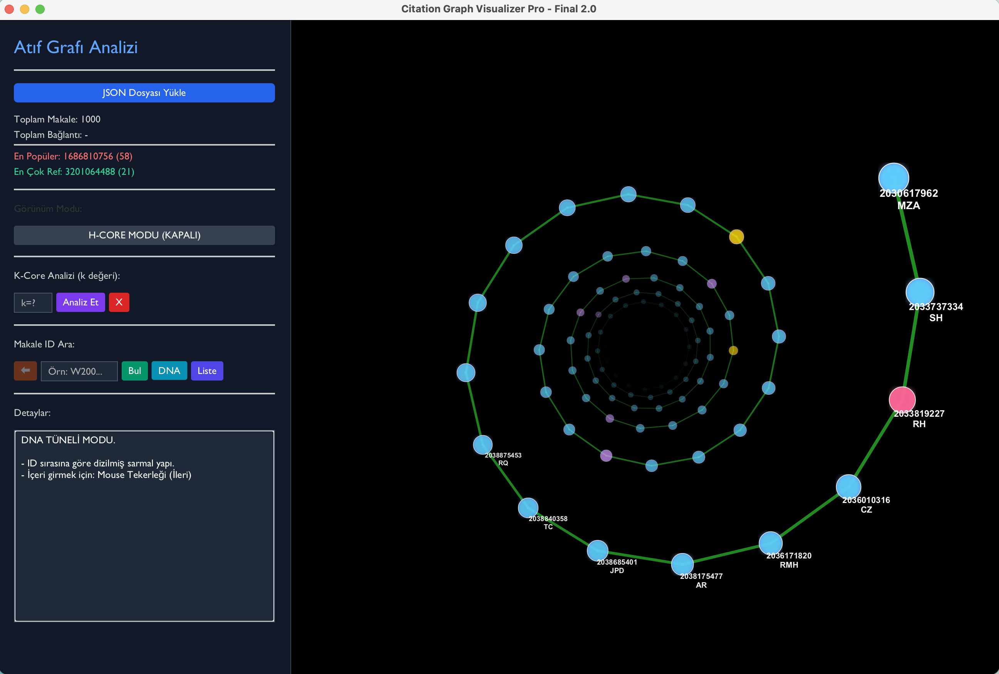

# 🧬 Citation Graph Analysis & Visualization Tool

  

This project is a comprehensive desktop application designed to analyze, visualize, and run complex graph algorithms on **citation networks** of scientific articles.

Developed within the scope of the **Programming Laboratory** course at Kocaeli University, Computer Engineering Department.

## 🚀 About the Project

The tool is designed to explore the relationships between scientific papers, identify "bridging" studies that connect different disciplines, and calculate academic impact metrics (like H-Index) using custom graph implementations.

It processes large datasets (in JSON format) and offers users **3 distinct visualization modes** to interpret the data.

## ✨ Key Features

### 1. Visualization Modes
* **🕸️ Standard Graph Mode:** Focuses on a selected article as the center node. References (outgoing) and citations (incoming) are arranged using a physics-based **Force-Directed** algorithm.
* **🧬 3D DNA (Helix) Mode:** Visualizes articles inside a 3D rotating spiral tunnel, sorted by their publication date and IDs. Provides depth perception and temporal analysis.
* **📊 Grid Mode:** Displays the general distribution of the entire dataset in a matrix format.

### 2. Algorithmic Analysis
The project implements the following algorithms using custom data structures:
* **Betweenness Centrality (Brandes Algorithm):** Identifies the most strategic "bridge" articles that control the flow of information within the network.
* **K-Core Decomposition:** Peels away weak connections (like an onion) to reveal the most tightly connected "core" group of the graph.
* **H-Index & H-Core:** Calculates the academic impact factor of an article/author and filters the high-quality citation subset.
* **H-Median:** Analyzes the median citation count within the H-Core cluster.
* **Shortest Path (BFS):** Finds the citation chain/distance between any two given articles.

## 🛠 Technical Details

* **Programming Language:** Java (JDK 17+)
* **GUI Framework:** JavaFX
* **Data Structures:** Custom Graphs, HashMap, ArrayList, Stack, Queue.
* **Data Format:** JSON (Custom Parser)

## 📸 Screenshots

| Standard Graph View | DNA (Helix) Mode |
| :---: | :---: |
|  |  |
*(Update these links after uploading your screenshots to a 'screenshots' folder)*

| K-Core Analysis | Betweenness & Tooltip |
| :---: | :---: |
|  |  |

## 👥 Contributors

* **[Erva Alacan](https://github.com/ervalcn)**
* **[Nisa Nur Yağlı](https://github.com/nisayagli0)**

---